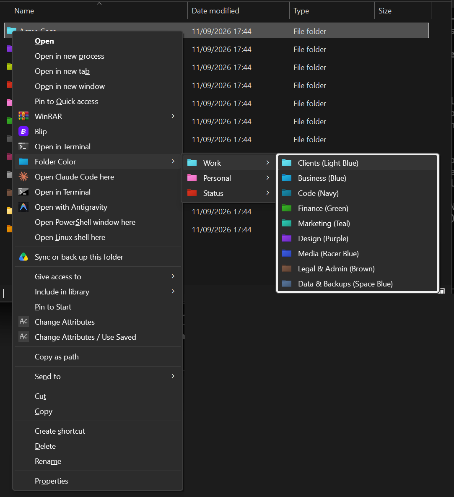

<h1 align="center">Folder Colors</h1>
<p align="center">Colour-code Windows 11 folders by category from the right-click menu, or let Claude do it for you.</p>

<p align="center"></p>

Twenty folder icons, each tied to a category you can rename. Right-click a folder, pick
"Folder Color", pick "Work > Clients", and the folder turns light blue. The mapping lives
in one JSON file. A `SKILL.md` at the repo root turns the same toolkit into a Claude Code
skill, so "organise my Projects folder by category" becomes a table you approve and a set
of coloured folders.

<p align="center"></p>

## Install

Built and tested on Windows 11. Windows 10 uses the same registry and `desktop.ini`
mechanisms but has not been tested. No admin rights needed.

```powershell
git clone https://github.com/Ramonvdo/folder-colors.git
cd folder-colors
.\install.ps1
```

Keep the folder where it is: the menu points at the scripts and icons inside it. If you
move it later, run `.\install.ps1` again.

Downloaded the zip instead of cloning? Same three steps, from inside the extracted folder.
If PowerShell refuses to run the script, right-click `install.ps1`, choose Properties and
tick Unblock, or run `powershell -ExecutionPolicy Bypass -File .\install.ps1`.

## Use

### From Explorer

Right-click any folder, open "Folder Color", pick a group, pick a
category. "Reset to default" at the bottom puts the plain yellow folder back. On the
Windows 11 default menu the entry sits under "Show more options" (or press Shift+F10).

### From PowerShell

```powershell
.\Set-FolderColor.ps1 -List                                   # the 20 categories
.\Set-FolderColor.ps1 -Path 'D:\Clients\Acme' -Category Clients
.\Set-FolderColor.ps1 -Path 'D:\Clients\Acme' -Color 'Light Blue'   # same thing
.\Set-FolderColor.ps1 -Path 'D:\Clients\Acme' -Get            # what is it now?
.\Set-FolderColor.ps1 -Path 'D:\Clients\Acme' -Reset
```

The icon changes straight away. If an Explorer window still shows the old one, press F5.

## Customise

Everything is in `categories.json`:

```json
{
  "menuLabel": "Folder Color",
  "labelFormat": "{category} ({color})",
  "groups": ["Work", "Personal", "Status"],
  "categories": [
    { "index": 12, "color": "Light Blue", "category": "Clients", "group": "Work",
      "description": "One folder per client or customer", "hints": ["client", "customer"] },
    ...
  ]
}
```

- Rename a category, move it to another group, or change the label format, then run
  `.\install.ps1` again. Folders you already coloured keep their colour: the folder stores
  the icon `index`, and the name lives only in the menu.
- Explorer shows at most 16 entries per cascade. That is why categories sit inside groups.
  Keep a group at 16 categories or fewer, and the number of groups at 15 or fewer.
- `description` and `hints` are read by the Claude skill when it sorts folders; the menu
  ignores them.

## Use it with Claude Code

The repo root is a Claude Code skill. Link it into your skills folder once:

```powershell
New-Item -ItemType Junction -Path "$env:USERPROFILE\.claude\skills\folder-colors" -Target (Get-Location).Path
```

Then, in any Claude Code session:

- "Colour `D:\Clients\Acme` as a client folder."
- "Organise my Documents folder by category." Claude lists the subfolders, proposes a
  category for each with a one-line reason, waits for your approval, applies it, and
  checks every folder afterwards.
- "Rename the Marketing category to Content and rebuild the menu."

`SKILL.md` holds the rules Claude follows, including the folders it never touches.

## Uninstall

```powershell
.\uninstall.ps1
```

Removes the menu. Coloured folders keep their icons for as long as this folder exists;
run `.\Set-FolderColor.ps1 -Path <folder> -Reset` on any you want plain again.

## How it works

- Windows lets a folder pick its own icon through a hidden `desktop.ini`. The script writes
  one pointing at icon `n` inside `assets\Windows_11_coloured_icons.icl`, sets the
  read-only and system attributes Explorer requires, and calls `SHChangeNotify` so the
  icon repaints at once. A `desktop.ini` that is already there (a folder-type template, a
  folder picture, an icon you set through Properties) is kept: only the icon lines change,
  and "Reset to default" restores the icon and attributes the folder had before.
- The menu is a single key under `HKCU\Software\Classes\Directory\shell`. Each entry runs
  `powershell.exe -WindowStyle Hidden -File Set-FolderColor.ps1 -Path "%1" -Index n`.
  Errors show up in a message box instead of a console.
- Nothing runs in the background, nothing phones home, and no administrator rights are
  involved. See `SECURITY.md`.

## Licence and credits

The scripts, skill and documentation are MIT (see `LICENSE`).

The icon pack is
[Windows 11 coloured folder icons](https://www.deviantart.com/abs96/art/Windows-11-coloured-folder-icons-896431403)
by ABS96, licensed CC BY-NC-ND 3.0 and included unmodified. That licence, not MIT, applies
to the `.icl` file: credit the author, no commercial use, no modifications. Details in
`NOTICE.md`.

The right-click idea comes from
[nazsa13/Windows11-Folder-Colors](https://github.com/nazsa13/Windows11-Folder-Colors).
This is a rewrite: per-user install with no admin prompt, no manual path editing, a
category layer, a Claude skill, and an immediate icon refresh.
