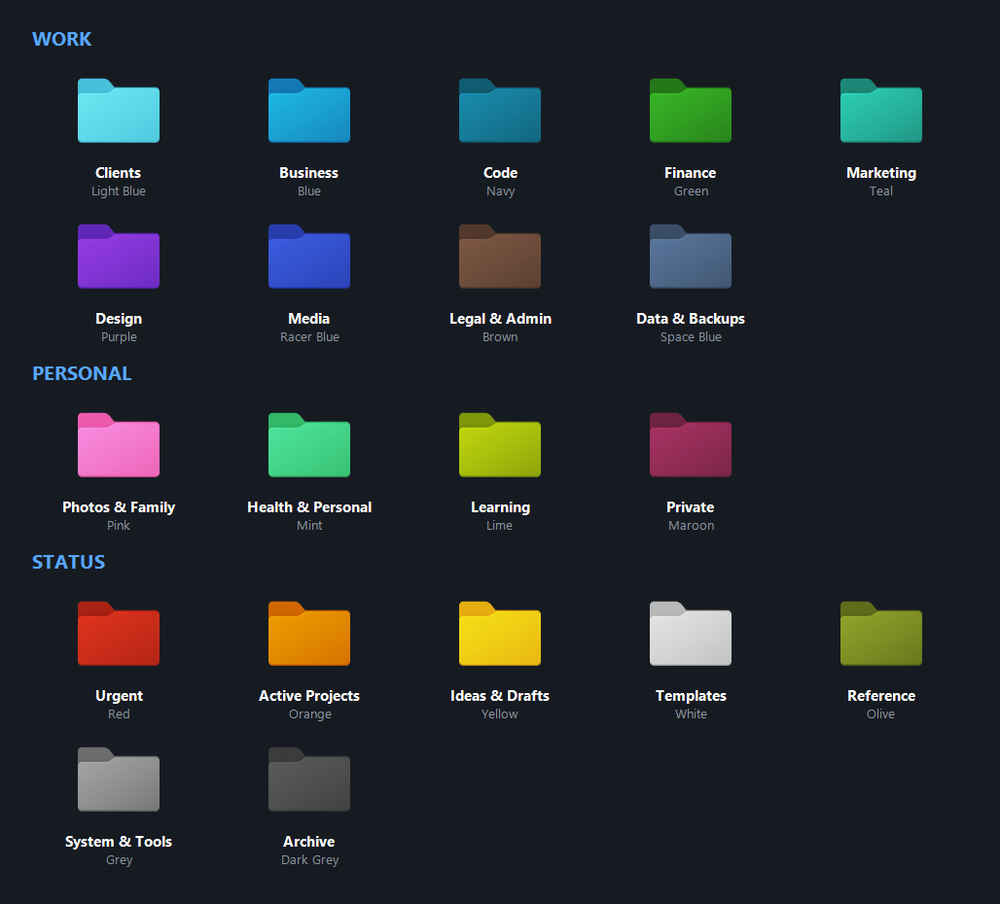

<h1 align="center">Folder Colors</h1>
<p align="center">Colour-code Windows 11 folders by category from the right-click menu, or let Claude do it for you.</p>

<p align="center"></p>

Twenty folder icons, each tied to a category you can rename. Right-click a folder, pick
"Folder Color...", click "Clients", and the folder turns light blue. The category name also
lands in the folder's Tags and Categories, so Explorer can show, sort and group by it. The
mapping lives in one JSON file. Four Claude Code skills ship with it, as a plugin:
`folder-colors` colours one folder on request, `auto-color` colours a whole tree or a
project at once, `tidy-folder` brings order inside one folder (with a strict, sourced
finance profile), and `organize-pc` turns "organise my PC" into a proposal table you
approve, numbered areas with a README each, and a map of the machine any LLM reads first.

## Install

Built and tested on Windows 11. Windows 10 uses the same registry and `desktop.ini`
mechanisms but has not been tested. No admin rights needed.

```powershell
git clone https://github.com/Ramonvdo/folder-colors.git
cd folder-colors
.\install.ps1
```

Keep the folder where it is: the menu points at the scripts and icons inside it. If you
move it later, run `.\install.ps1` again.

Downloaded the zip instead of cloning? Same three steps, from inside the extracted folder.
If PowerShell refuses to run the script, right-click `install.ps1`, choose Properties and
tick Unblock, or run `powershell -ExecutionPolicy Bypass -File .\install.ps1`.

## Use

### From Explorer

Right-click any folder and pick "Folder Color...". A palette opens at the cursor with every
category, grouped; the folder's current colour is outlined. Click a tile to apply it,
"Reset to default" to put the plain yellow folder back, Esc or a click elsewhere to cancel.
The palette takes about a second to appear (it is a PowerShell window). On the Windows 11
default menu the entry sits under "Show more options" (or press Shift+F10).

### From PowerShell

```powershell
.\Set-FolderColor.ps1 -List                                   # the 20 categories
.\Set-FolderColor.ps1 -Path 'D:\Clients\Acme' -Category Clients
.\Set-FolderColor.ps1 -Path 'D:\Clients\Acme' -Color 'Light Blue'   # same thing
.\Set-FolderColor.ps1 -Path 'D:\Clients\Acme' -Get            # what is it now?
.\Set-FolderColor.ps1 -Path 'D:\Clients\Acme' -Reset
```

The icon changes straight away, in open Explorer windows too.

### Tags and Categories

Colouring a folder also writes the category name into the folder's Tags and Categories
properties. Add the Tags column in Explorer (right-click a column header) to see it, sort
on it, or use View > Group by > Tags. Tags a folder already had are kept; Reset removes only
the one this tool added. Windows Search does not index folder tags, so `tags:Finance` in
the search box only finds files. Set `"writeTags": false` in `categories.json` to turn this
off.

## Customise

Everything is in `categories.json`:

```json
{
  "menuLabel": "Folder Color",
  "writeTags": true,
  "groups": ["Work", "Personal", "Status"],
  "categories": [
    { "index": 12, "color": "Light Blue", "category": "Clients", "group": "Work",
      "description": "One folder per client or customer", "hints": ["client", "customer"] },
    ...
  ]
}
```

- Rename a category, move it to another group, or reorder them: the palette reads the file
  every time it opens, so there is nothing to re-run. Folders you already coloured keep
  their colour: the folder stores the icon `index`, and the name lives only in the palette.
- `description` shows as the tile's tooltip; `hints` are read by the Claude skill when it
  sorts folders. Add words in your own language there (`factuur`, `Rechnung`) so files get
  recognised the way you name them.
- Why a palette and not a submenu: Explorer allows 16 entries in a cascading menu, nested
  entries included, and 20 categories plus Reset do not fit.

## Use it with Claude Code

The repo is a Claude Code plugin with four skills. Two ways to get them:

```powershell
# Plugin (any machine): one marketplace, one install, all four skills
claude plugin marketplace add Ramonvdo/folder-colors
claude plugin install folder-colors@folder-colors

# Developer path: link the checkout's skills into ~\.claude\skills as junctions
.\install.ps1 -LinkSkills
```

Both routes need the checkout for the right-click menu (`install.ps1` registers it and
records where the checkout is, so the skills find the scripts from anywhere). Other agents
that read `AGENTS.md` (Codex, Cursor, OpenCode, Gemini CLI) find the same skills through
it.

**folder-colors** (`skills\folder-colors`) colours and tags one folder:

- "Colour `D:\Clients\Acme` as a client folder."
- "Rename the Marketing category to Content."

**auto-color** (`skills\auto-color`) colours many existing folders at once, nothing moves:

- "Colour-code everything in `D:\Projects`." One table, one yes.
- "Colour this workspace." `src`, `docs`, `tests`, `assets` get their colours; the
  `desktop.ini` files go into `.git\info\exclude`, so `git status` stays clean.
- "Which folders have no colour yet?"

**tidy-folder** (`skills\tidy-folder`) brings order inside one folder:

- "Tidy this folder." Loose files grouped into a few subfolders by topic or type, names
  normalised to `YYYY-MM-DD_Type_Name`, each as its own undoable batch.
- "Set up my finance folder" or "file these invoices." The finance profile asks where the
  business is tax-resident first, then files by year and document type with names read
  from the documents themselves (`2026-02-04_Invoice_Acme_2026-0142.pdf`). The
  Netherlands is the worked example, cited to the tax authority; other countries get a
  template of what to look up, and nothing is assumed. Sources in
  `skills\tidy-folder\references\sources.md`.

**organize-pc** (`skills\organize-pc`) structures the machine and keeps it that way:

- "Organise my PC." A short interview, a read-only inventory of the roots you choose, then
  a proposal table: numbered areas (`01_CLIENTS`, `04_FINANCE`, `99_ARCHIVE`, ...), each
  with a colour and a tag, and a target for every existing folder and stray file. Nothing
  moves until you approve the table. Every move is logged and can be undone as a batch.
  Each area gets a `00_README.md` (its rules, in the folder itself) and the machine gets a
  `PC-MAP.md` in your profile that any LLM reads first.
- "Tidy my Downloads." Files get a place according to the map and the READMEs; Storage
  Sense can be set to delete what sits in Downloads untouched for 14 days. That rule is
  Windows deleting files on a schedule: it is off unless you say yes to it.
- "Where do client invoices go?" Answered from the READMEs, with the rule quoted.
- "How is my PC doing?" The health table: transit folders, drift, stale areas, missing
  READMEs, missing colours.
- "Undo the last reorganisation."

It asks before it changes anything, every time, and it starts every run by looking for
opportunities to put to you as questions ("no finance folder for this business, want one
set up?") rather than acting on them. Your own layout counts as a preset: adopt mode keeps
your folder names and only adds colours, READMEs and the map if you say so. Folders with
a `.git`, `CLAUDE.md`, `AGENTS.md`, a build file or an Obsidian vault inside are
workspaces: moved whole if at all, never rearranged inside.

The map keeps itself honest: `skills\organize-pc\scripts\Update-PcMap.ps1` rewrites its
auto section from the real folders (new folders you made by hand show up as unmapped),
and can be registered as a daily task. The doctrine behind the layout is in
`skills\organize-pc\references\principles.md`; the starting layouts (a business one, a
value-chain one, and PARA) with their sources in `presets.md` and `sources.md`.

## Uninstall

```powershell
.\uninstall.ps1
```

Removes the menu. Coloured folders keep their icons for as long as this folder exists;
run `.\Set-FolderColor.ps1 -Path <folder> -Reset` on any you want plain again.

## How it works

- Windows lets a folder pick its own icon through a hidden `desktop.ini`. The script writes
  one pointing at icon `n` inside `assets\Windows_11_coloured_icons.icl`, then applies it
  through `SHGetSetFolderCustomSettings`, the same call Properties > Customize uses, which
  is what makes open Explorer windows repaint at once. A `desktop.ini` that is already
  there (a folder-type template, a folder picture, an icon you set through Properties) is
  kept: only the icon lines change, and "Reset to default" restores the icon and
  attributes the folder had before.
- The menu entry is a single key under `HKCU\Software\Classes\Directory\shell`. It runs
  `run-hidden.vbs`, which starts `Pick-FolderColor.ps1` without a console window; the
  palette calls `Set-FolderColor.ps1` with the index you clicked. Errors show up in a
  message box.
- Tags and Categories are the standard folder properties Explorer reads from `desktop.ini`
  (the `{F29F85E0-...}` and `{D5CDD502-...}` property-set sections).
- Nothing phones home and no administrator rights are involved. Nothing runs in the
  background either, unless you register the optional daily map refresh from organize-pc.
  See `SECURITY.md`.

## Licence and credits

The scripts, skill and documentation are MIT (see `LICENSE`).

The icon pack is
[Windows 11 coloured folder icons](https://www.deviantart.com/abs96/art/Windows-11-coloured-folder-icons-896431403)
by ABS96, licensed CC BY-NC-ND 3.0 and included unmodified. That licence, not MIT, applies
to the `.icl` file: credit the author, no commercial use, no modifications. Details in
`NOTICE.md`.

The right-click idea comes from
[nazsa13/Windows11-Folder-Colors](https://github.com/nazsa13/Windows11-Folder-Colors).
This is a rewrite: per-user install with no admin prompt, no manual path editing, a
category layer with tags, a palette instead of a capped submenu, a Claude skill, and an
immediate icon refresh.
